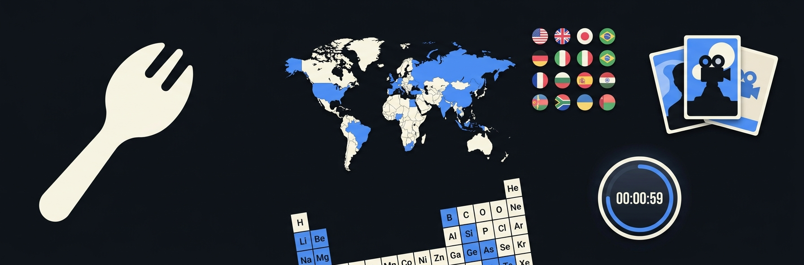

<p align="center">
  
</p>

# Spork

**A stack of little brain games.** Spork is one app — one home screen — that hosts a growing shelf of
**distinct games**, the way Sporcle offers Quizzes _and_ Acrostic, Chess Attack, Quizzle, and Steps as
separate games with their own rules. Not one engine wearing hats: genuinely different games, unified
by a shared shell and a common feel. Play instantly as a **guest** — no account required.

Shipping today: **Quizzes** (Sporcle-style — name every country on a map, the US presidents, the
periodic table, against a clock) and **Flashcards** (AI-generated decks, spaced-repetition study). On
the roadmap: **Acrostic**, **Chess Attack**, **Quizzle**, **Steps**, and **Live Trivia** — each a
real, independent game (see [The games](#the-games)).

Spork is built as a **shell + game islands**: the platform (home, guest identity, streaks, the AI
generation pipeline, admin dashboard, quality/CI rig) is shared; each game is a self-contained island
under `src/games/<game>/` that plugs into it. **Adding a whole new game is a new island, not a
rewrite** — and _within_ a game like Quizzes, adding a new format is just new data or a new renderer.

> Architecture, quality bar, and toolchain descend from the **stoop** app via **flashstack** — the
> same Ionic + Amplify Gen2 stack, strict CI gates, and Gherkin-first → full-e2e workflow.

---

## The vision

Sporcle isn't one game — it's a **destination for many bite-sized brain games**, each with its own
mechanic, sharing an audience and a habit. Spork chases the same shape at two levels:

**Level 1 — a shelf of distinct games.** Quizzes, Acrostic, Chess Attack, Quizzle, Steps, Live
Trivia, Flashcards. These are _not_ variations of one engine; a chess variant and a word-ladder and a
timed quiz have nothing mechanically in common. What they share is the **platform**: one guest-first
home, streaks, a consistent look, and the build/quality rig. Each new game is an island you can add
without touching the others — the payoff is a habit-forming _stack_, not a single hit.

**Level 2 — within a game, breadth for free.** The first game, Quizzes, is itself broad (~1.5M
Sporcle quizzes span dozens of formats). Here the bet is **one small engine, a handful of renderers,
and an ocean of data**:

1. **One content model.** Every quiz — a world map, a flag grid, a "name the Beatles" foursome, the
   periodic table — is a `Quiz` plus universal `Answer` rows. One shape, discriminated by a
   `promptKind` + grouping (mirroring how Sporcle's own `game` + `entry` tables work under the hood).
2. **A few renderers.** How you're _prompted_ (map region, image, text clue, grid cell, nothing) and
   how you _answer_ (type, click, pick, arrange) are small, swappable axes over the same engine.
3. **An ocean of data.** Content comes from **curated templates** (maps — the topology _is_ the
   answer set, so nothing is hallucinated), **AI generation** (Claude writes typed/MC/picture quizzes
   on demand), and eventually **imported quizzes** (see [Importing quizzes](#importing-sporcle-quizzes)).

The engineering discipline that makes both levels cheap is the same: get the **seams** right (a sharp
platform/game boundary; a universal answer model) so breadth — more games, more formats — comes
almost for free.

---

## The games

Each is a real, independent game. Quizzes and Flashcards ship today; the rest are on the roadmap, each
planned as its own island under `src/games/<game>/` reusing the shared shell.

| Game             | Status      | What it is                                                                                                   |
| ---------------- | ----------- | ------------------------------------------------------------------------------------------------------------ |
| **Quizzes**      | ✅ shipping | Sporcle-style "name them all against a clock," across 9 interaction formats (see [Quiz types](#game-types)). |
| **Flashcards**   | ✅ shipping | AI-generated decks studied with spaced repetition (SM-2). The flashstack app, folded in as a game.           |
| **Acrostic**     | ⬜ planned  | A word puzzle: solve clues whose letters fill a grid, revealing a hidden quote a little at a time.           |
| **Steps**        | ⬜ planned  | Word ladder — transform a start word into a target one change at a time.                                     |
| **Chess Attack** | ⬜ planned  | A fast chess variant on a small board — few powerful pieces, quick chaotic games.                            |
| **Quizzle**      | ⬜ planned  | A pub-quiz "road trip" where you **wager** on your confidence per answer — points ride on the bet.           |
| **Live Trivia**  | ⬜ planned  | Real-time multiplayer rounds — everyone answers the same question on a shared clock, live leaderboard.       |

These differ on every axis that matters — input (type/click/drag/move a piece), scoring (found-set /
wager / win-condition), session (solo-vs-clock / real-time-multiplayer). That diversity is the point:
the shared platform is what makes carrying all of them viable, not a pretense that they're one engine.

---

## Game types

Spork's Quizzes game targets every Sporcle-style interaction format. Each one reuses the **same
`Answer` row and play engine**, differing only along three axes — **prompt** (what you see), **input**
(how you answer), and **scoring** (what "correct" means):

| Type                | You…                                                  | Prompt   | Input   | Scoring    |
| ------------------- | ----------------------------------------------------- | -------- | ------- | ---------- |
| **Classic**         | type answers to reveal a hidden list                  | none     | type    | membership |
| **Map**             | type a place → its region fills in on an SVG map      | region   | type    | membership |
| **Picture Box**     | identify people/things from images by typing          | image    | type    | membership |
| **Multiple Choice** | pick the correct option, one question at a time       | text     | pick    | membership |
| **Clickable**       | click the correct tiles out of a displayed set        | text/img | click   | membership |
| **Picture Click**   | click the right spot on a single image (map/diagram)  | region   | click   | membership |
| **Slideshow**       | answer one prompt per slide, advancing through a deck | text/img | type    | membership |
| **Sortable**        | drop each item into its correct bucket/category       | text     | arrange | bucketing  |
| **Order Up**        | arrange items into the correct sequence / ranking     | text     | arrange | sequence   |

On top of these sit **scoring variants** that reuse a type's renderer with one engine flag —
**Minefield** (one wrong answer ends the run), **Blitz** (race a short clock), **Alphabet** (one
answer per letter). (These are all _within_ the Quizzes game — the separate games like Acrostic and
Chess Attack live at [Level 1](#the-games).)

### The three axes, concretely

- **Prompt** (`Answer.promptKind`): `NONE` · `TEXT` (a clue) · `IMAGE` (a media key) · `REGION` (an
  SVG/id) · `CELL` (a grid coordinate). Plus `Answer.groupKey` to tie several rows to one prompt (a
  four-member "foursome").
- **Input** (`Quiz.inputMode`): `type` · `pick` · `click` · `arrange`.
- **Scoring** (`Quiz.scoringMode`): `membership` (find them all — the found-set engine) · `sequence`
  (Order Up) · `bucketing` (Sortable) · `elimination` (Minefield).

Most types are just a combination of these plus a renderer component. `membership` types share one
engine; `sequence`/`bucketing`/`elimination` are deliberate engine variants, not forced fits.

---

## Importing Sporcle quizzes

A long-term goal is to **import a large corpus of existing quizzes** into Spork's format so the
library is deep from day one. The plan:

1. **Scrape** public quiz pages (respecting rate limits / robots) into a raw archive — title,
   category, type, the answer list, and any per-type extras (map region ids, image URLs, clues,
   groups).
2. **Map** each source type onto a Spork `(promptKind, inputMode, scoringMode)` triple — the table
   above _is_ the mapping. Because the target model is universal, this is a data transform, not a
   per-type integration.
3. **Normalize** answers into our `accepted[]` shape (lowercase/accent/punct-insensitive) and
   reconcile any media/geometry to Spork assets.
4. **Load** as `Quiz` + `Answer` rows via the same path the seed and generation pipeline use.

> ⚖️ **Note:** quiz content and trademarks belong to their authors/Sporcle. Import is intended for
> personal/experimental use and content we have the right to use; a public launch would require
> original or appropriately-licensed content. This is a technical capability, not a license.

---

## Tech Stack

| Layer                   | Choice                                                                           |
| ----------------------- | -------------------------------------------------------------------------------- |
| **Mobile / Web client** | [Ionic](https://ionicframework.com/) 8 + React 19 + TypeScript (strict)          |
| **Native shell**        | [Capacitor](https://capacitorjs.com/) (iOS / Android) + installable **PWA**      |
| **Bundler**             | Vite                                                                             |
| **Backend**             | AWS Amplify Gen2 — Cognito (guest identity) + AppSync (GraphQL) + DynamoDB       |
| **Maps**                | `react-simple-maps` + `world-atlas` topology + `i18n-iso-countries` (build-time) |
| **Testing**             | Vitest + Istanbul coverage (unit) · Playwright + playwright-bdd Gherkin (e2e)    |
| **AI**                  | Bedrock Claude (tool-forced structured output) for generated quiz content        |

---

## Architecture

```
                       ┌─────────────────────── Spork (platform shell) ───────────────────────┐
                       │  Home game shelf · guest identity · streaks · admin · quality/CI      │
                       └───────────────┬───────────────────────────────┬──────────────────────┘
                                       │                               │
                        ┌──────────────▼─────────────┐   ┌─────────────▼──────────────┐
                        │   Quizzes  (this repo)      │   │       Flashcards           │
                        │                             │   │  Deck → Card, SM-2 study   │
                        │  generateQuiz ─┬─ template  │   └────────────────────────────┘
                        │   (mode fork)  │  (MAP: no LLM, from topology fixture)
                        │                └─ generative (Bedrock: typed/MC/picture …)
                        │                         │
                        │   Quiz (PUBLISHED) ──► Answer[]  {promptKind, promptValue,
                        │        │                          groupKey, display, accepted[]}
                        │        ▼
                        │   play engine: normalize → match → found-set + timer + score
                        │   renderer registry: RENDERERS[quiz.mode]  (Map shipped; others land here)
                        │        │
                        │        ▼  best score per-device (localStorage — guest-only)
                        └─────────────────────────────────────────────────────────────┘
```

### Core models

| Model           | Purpose                                                                                     |
| --------------- | ------------------------------------------------------------------------------------------- |
| `Quiz`          | Published unit: topic, `mode`, `inputMode`, `scoringMode`, time limit, `renderConfig` JSON. |
| `Answer`        | Universal row: `promptKind`, `promptValue`, `groupKey`, `display`, `accepted[]`, `options`. |
| `Category`      | Discover shelves (browsable rows + order/labels), shared across games.                      |
| `GenerationRun` | One template/AI generation run — powers the admin dashboard (`game` + `mode`).              |
| `Deck` / `Card` | The Flashcards game (inherited): spaced-repetition study.                                   |

Best scores for the guest-only Quizzes game live on the **device** (`localStorage`), not in a
per-user model — no account needed to play or to keep a personal best.

---

## Getting Started

```bash
git clone https://github.com/johnpc/spork
cd spork
npm install
npm run dev            # Vite dev server (or: ionic serve)
```

### Backend sandbox

The Amplify Gen2 backend lives in [`amplify/`](amplify/). Spin up a personal cloud sandbox (deploys
to your AWS account and writes `amplify_outputs.json`):

```bash
npx ampx sandbox
npm run gen:map-template   # (re)build the world-countries map fixture
npm run seed               # seed categories, a demo deck, and the World Countries quiz
```

### Brand assets

```bash
npm run gen:icons          # regenerate PWA + iOS (light/dark/tinted) + Android icons
                           # from assets/icon.png (light) & assets/icon-dark.png (dark)
```

---

## Quality Gates

Every gate runs in CI on PRs to `main`, and the blocking gates also run locally on every commit via a
Husky pre-commit hook.

| Command                  | What it checks                                                                    |
| ------------------------ | --------------------------------------------------------------------------------- |
| `npm run lint`           | ESLint — including `no-explicit-any: error` (no `any`, ever)                      |
| `npm run format:check`   | Prettier formatting                                                               |
| `npm run check:lines`    | File-length discipline — every `.ts`/`.tsx` source file stays ≤ 100 lines         |
| `npm run check:features` | Every `.feature` file is mapped to a CI acceptance area (no silently-unrun specs) |
| `npm run test:coverage`  | Vitest unit tests with an **80% floor** (statements/branches/functions/lines)     |
| `npm run crap`           | **CRAP score** per function — fails any function over **15**                      |
| `npm run build`          | TypeScript + Vite production build                                                |
| `npm run test:e2e`       | **Gherkin** acceptance tests via Playwright + playwright-bdd                      |
| `npm run quality`        | Runs the full local gate in sequence                                              |

All acceptance tests are written as Gherkin `.feature` files — never raw spec code. Every data-reading
flow asserts on **rendered real (seeded) data** (e.g. a map region actually filling in), not just
navigation. The fix for low coverage is always a new test, never an exclusion.

---

## iOS / Android / PWA

The web build is an installable **PWA** (`public/manifest.json`, maskable icons). Capacitor wraps it
for the stores: `.github/workflows/ios-deploy.yml` archives + uploads to TestFlight;
`android-deploy.yml` builds and publishes an APK — both after CI succeeds on `main`. The iOS app icon
ships **light, dark, and tinted** variants.

- **Bundle id:** `com.johncorser.spork`
- Required repo secrets: `AWS_ACCESS_KEY_ID`, `AWS_SECRET_ACCESS_KEY`, `TEST_USERNAME`,
  `TEST_PASSWORD`, `ASC_KEY_ID`, `ASC_ISSUER_ID`, `ASC_KEY_CONTENT`, `TEAM_ID`.

---

## Roadmap

| #   | Milestone                                                                              | Status |
| --- | -------------------------------------------------------------------------------------- | ------ |
| 1   | Platform fork + guest-only Quizzes game + **Map** mode (template-backed, e2e verified) | ✅     |
| 2   | Universal 3-axis model + all 9 Sporcle quiz formats (renderer + seed + e2e each)       | ✅     |
| 3   | AI generation for typed/MC/picture quizzes (Bedrock generative branch)                 | 🔨     |
| 4   | Quiz import pipeline (scrape → map → normalize → load)                                 | ⬜     |
| 5   | Discovery: browse/search/categories, popularity, per-device history                    | ⬜     |
| 6   | **New games** (own islands): Acrostic, Steps, Chess Attack, Quizzle, Live Trivia       | ⬜     |

---

## License

The **code** in this repository is provided as a personal/experimental project — see the repo for
terms. **Quiz content is not covered:** any imported or third-party quiz data and trademarks (Sporcle
and others) remain the property of their respective owners, and the import capability described above
is intended only for content one has the right to use.
